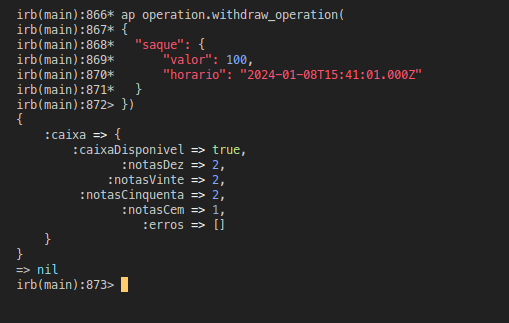

# README

# PT-BR
* Ruby versão 3.2.2

* 1 - Configuração
   - EXECUTAR `bundle install`
   - EXECUTAR `docker-compose build`

* 2 - Como rodar e testar
   - No terminal executar docker-compose run web rails c
   - Inserir os dados fornecidos da seguinte forma:

   ``` ruby
      operation = OperationMachine.new
      ap operation.deposit_operation(
      {
        "caixa": {
          "caixaDisponivel": true,
          "notas": {
            "notasDez": 100,
            "notasVinte": 50,
            "notasCinquenta": 10,
            "notasCem": 30
          }
        }
      })

      ap operation.withdraw_operation(
      {
        "saque": {
          "valor": 600,
          "horario": "2024-01-08T15:41:01.000Z"
        }
      })
   ```
Como pode ser observado acima, existem dois métodos responsáveis pelo serviço, `deposit_operation` para o depósito e `withdraw_operation` os dois estão na instancia de `OperationMachine` que consequentemente está na vaiável `operation` neste exemplo, podendo usar qualquer nome de variável para tal.

* OBS:

  - O método `ap` utilizado nos testes é opcional, é um recurso do gem `amazing-print` para estruturar os dados retornados no console do Rails.

  - O devido a problemas de tempo, não consegui implementar a parte de testes unitários na qual gostaria.

  - Não adicionei esse caso de teste abaixo, pois não vi sentido no contexto desse desenvolvimento, pois `não há a possibilidade de um caixa não existir`, já que a aplicação em si já é o `caixa`, então ele pode não ter valor suficiente para saque, estar indisponível por causa do status, ou ter saque duplicado pela regra de tempo de 10 minutos com valor igual, mas nunca ser existente, para esse caso existir seria necessário haver uma implementação onde existiria mais de um caixa e eles tendo identificadores únicos, onde seriam selecionados inclusive no momento do saque ou deposíto, para definir em qual caixa seria realizada a operação, não tendo esse tipo de implementação, tendo que o exercício não pede, `fica impossível existir a opção em que o caixa não existe`, pois como dito antes a própria aplicação é o `caixa`.

  - Por motivos de facilitar organização, foi usada uma estrutura Rails, os códigos consistem em duas pastas dentro do diretório `app`, são elas `atm` e `errors`.

  


  # Exemplos:
  - Depósitos
    # Com sucesso.

    


    # Com erro de caixa pronto para uso e tentativa novo abastecimento.
    

  - Saques
    # Com sucesso.
    

    # Erro de valor insuficiente.
    

    # Erro de saque duplicado.
    

    # Caixa indisponível para saque.
    
